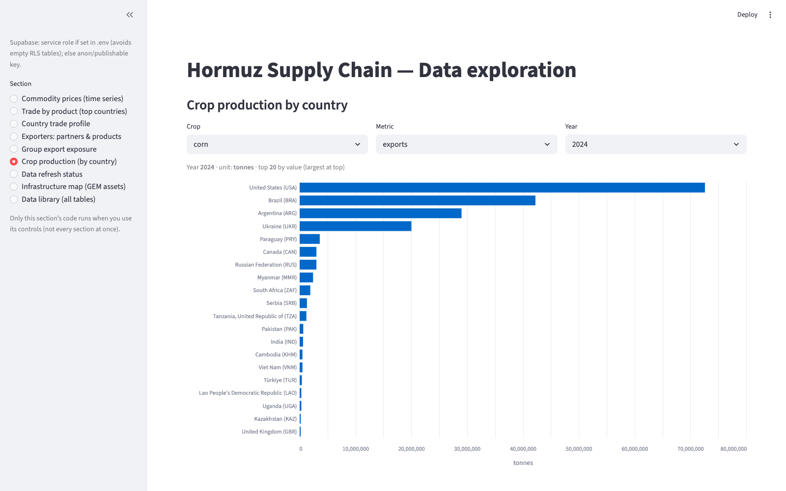

[Home](index.md) · [Map](infrastructure-map.md) · [Trade](trade.md) · [Prices](prices.md) · [Crops](crops.md) · [Data](data.md)

# Crops

Sidebar section: **Crop production (by country)**.

`crop_production` is filled by **FAOSTAT** (`pull_faostat.py`) and **USDA PSD** (`pull_usda_psd.py`). Pick crop, metric (production, area, yield, imports, exports), and year. Bars are the top 20 countries.

V1 crops: wheat, rice, corn, soybeans, cotton.

FAOSTAT production often lags **18–24 months**. USDA is the more timely production, stock, and trade picture for those five crops.

Related tables (Data library, not this chart): `fertilizer_production` (urea, ammonia, DAP, MAP) and `food_balance_sheets` (domestic supply, food, feed). Fertilizer **use by crop** is not in FAOSTAT.
