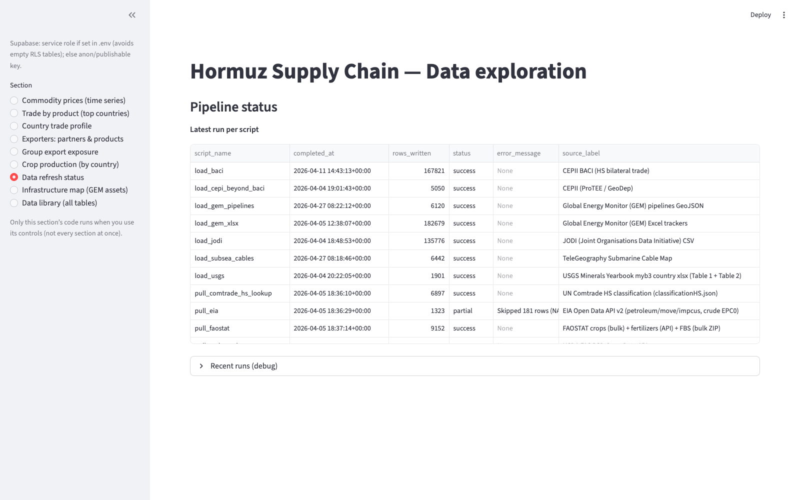

[Home](index.md) · [Map](infrastructure-map.md) · [Trade](trade.md) · [Prices](prices.md) · [Crops](crops.md) · [Data](data.md)

# Data

Sidebar section: **Data refresh status**. Rows are `pipeline_runs` — script, row count, time, success or error.

## Where the bytes are

| Location | Contents |
|----------|----------|
| `~/Downloads/supabase-narrative-backup` | Full table dump (CSV + `schema/`), ~1.2 GB, taken when the hosted project was still up |
| `data/baci/`, `data/cepi/`, `data/jodi/`, `data/usgs/` | Source files for loaders |
| `data/globalenergymonitor/` | GEM Excel trackers and pipeline GeoJSON |

The Streamlit app still speaks PostgREST. It no longer has a live hosted database.

## Loaded in the dump (order of magnitude)

BACI ~1.3M trade rows · GeoDep ~2.9M · GEM tracker ~193k · JODI ~136k · crops, fertilizers, prices, EIA flows, USGS MCS/yearbooks, subsea cables.

## Not in v1

- Hormuz **exposure score** or food-security cascade model
- Vessel-level transit counts through the strait
- Fertilizer consumption **by crop** (needs IFA)
- Petrochemicals (HS 29 / 39)
- CEPII WTFC / CHELEM zips (files may sit in `data/cepi/`; no loader)

Pullers: EIA, FAOSTAT, World Bank Pink Sheet, WDI, USDA PSD, Comtrade HS text. Loaders: BACI, CEPII ProTEE/GeoDep, JODI, USGS, GEM Excel.

Commands and schema: [README.md](https://github.com/marcocruising/gulfview/blob/main/README.md).
