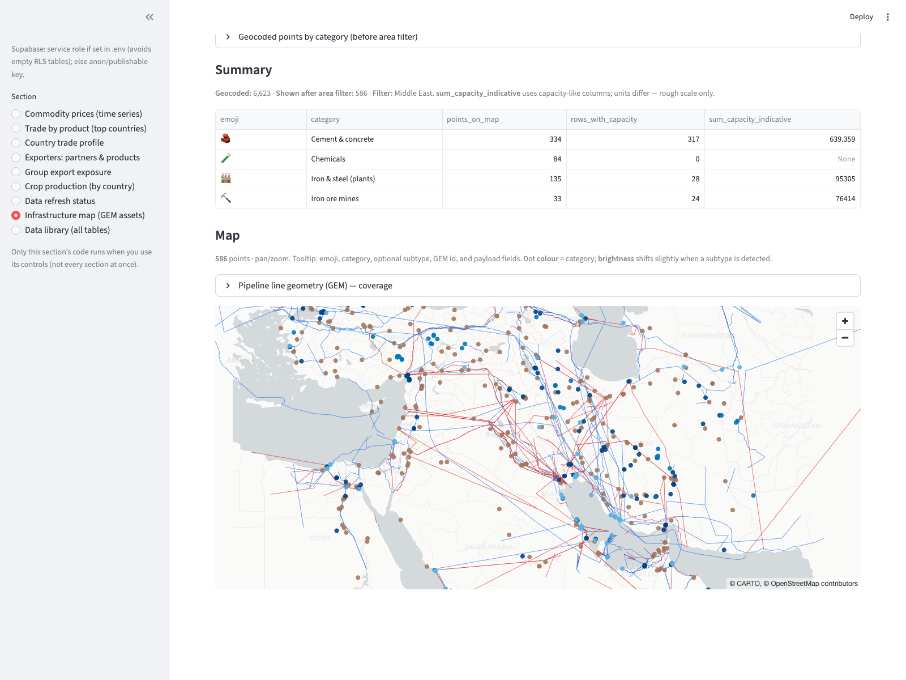

[Home](index.md) · [Map](infrastructure-map.md) · [Trade](trade.md) · [Prices](prices.md) · [Crops](crops.md) · [Data](data.md)

# Gulfview

Maps what a **Strait of Hormuz closure** would hit: crude, LNG, and refined products first, then fertilizers, then wheat, rice, corn, soy, and cotton.



```bash
uv run streamlit run app/streamlit_app.py
```

The hosted Supabase project is gone. Application tables are the local dump in `~/Downloads/supabase-narrative-backup`. Pipeline **lines** on the map are GEM GeoJSON under `data/globalenergymonitor/`.

## Features

| Page | What you see |
|------|----------------|
| [Infrastructure map](infrastructure-map.md) | GEM plants plus oil and gas routes (Middle East default) |
| [Trade](trade.md) | BACI top exporters and importers for one HS6 × year |
| [Prices](prices.md) | World Bank Pink Sheet monthly prices |
| [Crops](crops.md) | FAOSTAT / USDA rankings by crop, metric, year |
| [Data](data.md) | Last loader/puller runs, dump location, known holes |

## Also in the app sidebar

**Group export exposure** — for a country group (Gulf ISO3 by default), each HS6’s share of *world* exports, plus who inside the group ships it and which importers depend on the group. World shares are only honest if BACI has **all exporters** for those codes (`load_baci.py --hs6-codes`), not Gulf legs alone. Results can be saved and reopened without recomputing.

**Exporters: partners & products** — one exporter (Gulf codes listed first). Partner and supplier panels load on button press so a dropdown change does not fire a heavy query.

**Country trade profile** — one country’s imports and exports by HS6 for one year.

There is **no Hormuz exposure index** yet. The UI is for checking coverage and joins.
