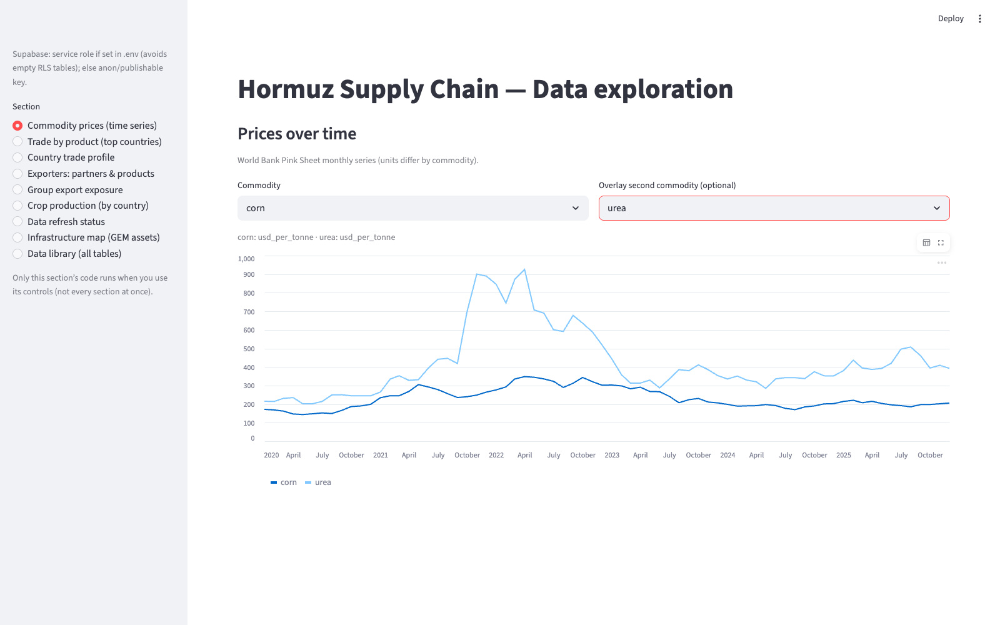

[Home](index.md) · [Map](infrastructure-map.md) · [Trade](trade.md) · [Prices](prices.md) · [Crops](crops.md) · [Data](data.md)

# Prices

Sidebar section: **Commodity prices (time series)**.

Source is the World Bank **Pink Sheet** (`commodity_prices`, `pull_worldbank.py`). Series include crude and Brent, urea, DAP, ammonia, wheat, rice, and corn. Units differ (USD/barrel vs USD/tonne); the caption under the dropdowns states which.

Overlay a second commodity on the same chart. The example is **corn** and **urea** — the fertilizer–grain link in the Hormuz cascade.

The Pink Sheet Excel URL on the World Bank site changes when they republish. If a pull fails, check `pipeline_runs.error_message` and update `PINK_SHEET_MONTHLY_XLSX_URL` in `pullers/pull_worldbank.py`.
