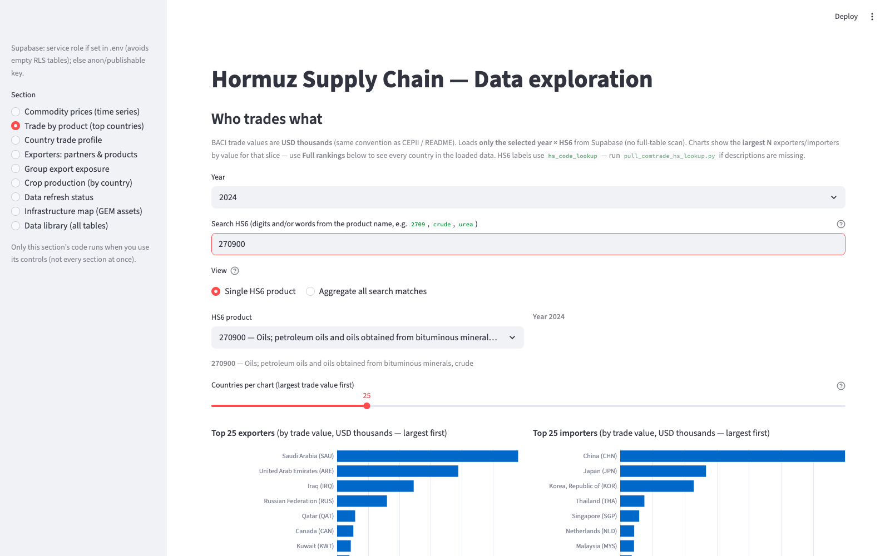

[Home](index.md) · [Map](infrastructure-map.md) · [Trade](trade.md) · [Prices](prices.md) · [Crops](crops.md) · [Data](data.md)

# Trade

Sidebar section: **Trade by product (top countries)**.

The chart is one **year × HS6** slice of CEPII **BACI** (`bilateral_trade`). Values are **USD thousands**. The dump has about **1.3 million** bilateral rows; the UI does not scan the whole table.

This example is HS **270900** (crude) in **2024**. Largest exporters are Gulf producers (Saudi Arabia, UAE, Iraq). Largest importers are East Asia (China, Japan, Korea).

Search matches six-digit codes or Comtrade English names (`hs_code_lookup`). “Aggregate all search matches” can sum a small set of codes (capped).

V1 HS prefixes used across loaders:

| Category | Prefix | Products |
|----------|--------|----------|
| Energy | 2709, 2710, 2711 | Crude, refined products, LNG / gas |
| Fertilizer | 2814, 3102–3105 | Ammonia, N/P/K, DAP/MAP blends |
| Crops | 1001, 1005, 1006, 1201, 5201 | Wheat, corn, rice, soy, cotton |

BACI is **annual**. There is no monthly trade series in v1.
